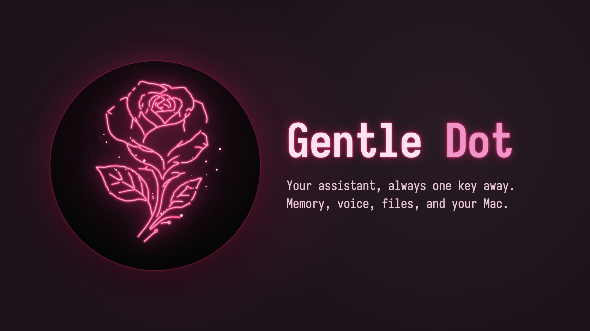

<!-- markdownlint-disable-next-line MD041 -->
<a id="top"></a>

<div align="center">



<h1>Gentle Dot</h1>

<p><strong>A personal assistant that lives on your desktop, remembers what matters, and can use your Mac for you.</strong></p>


https://github.com/user-attachments/assets/0c0f4d2d-7e0e-4c35-961a-8816d95a390c


<p>


<a href="LICENSE"></a>
</p>

<p>
<a href="https://gentlemanprogramming.com/"><strong>Website</strong></a> &bull;
<a href="docs/install.md"><strong>Install</strong></a> &bull;
<a href="docs/design.md"><strong>Design</strong></a> &bull;
<a href="https://github.com/Gentleman-Programming/gentle-ai"><strong>Gentle-AI</strong></a>
</p>

<br/>

<p>
Assistants live in a browser tab you have to go find, forget you between chats, and stop at the edge of the page.
<strong>Gentle Dot is one key away, keeps one continuous conversation with a real memory, and can talk, read your files, and operate your apps.</strong>
</p>

</div>

<br/>

> [!WARNING]
> **Early preview.** Gentle Dot can see your screen and control your Mac when you allow it, and it runs an AI agent with a shell. Its safety checks are real, but some still live within the agent's reach (see [Security status](#security-status)). Use it on a machine and accounts you are comfortable letting an assistant act on.

<br/>

<div align="center"></div>

## Features

---

### Always one key away

A glowing rose sits on your desktop. Click it, press your shortcut (**`⌥ Space`** unless you pick another), or use the menu bar, and the chat opens over whatever you are doing. Hide the rose if you prefer, or open the chat full screen with **`⌘⇧F`**. The same chat runs in the browser, on your machine or on your own server.

---

### One conversation, with memory

There is one continuous chat, not a list of threads to manage. When it grows too large, Gentle Dot quietly carries on in a fresh session seeded with a summary, so it stays fast and affordable. It remembers through your global **Engram™** memory: it saves to its own project, `gentle-dot`, and recalls from everything you keep there.

---

### Uses your Mac (macOS)

With your permission, Gentle Dot sees the screen and operates your apps: clicks, typing, shortcuts, and opening apps, batched into quick sequences. A pink glow shows where it acts. Every control session needs your approval in a native dialog, risky actions (send, pay, delete, submit) ask first, password managers and System Settings are off limits, and **`⌥⇧Esc`** stops everything instantly. Yolo mode skips the per-action questions for up to an hour, and only you can turn it on.

---

### Talk to it

Press the mic and speak: the transcript lands in the input for you to review, or goes out as soon as you stop if you prefer. Replies to what you said are read aloud. Speech runs on your Mac by default; download the optional local model (NVIDIA Parakeet, 25 languages including Spanish) to keep your voice fully offline, or connect an OpenAI API key.

---

### Your accounts, your models

Sign in with the subscriptions or API keys you already have (OpenAI, NaN, and others), save role profiles, and switch models from a chip above the input without leaving the chat.

---

### Connectors, with approvals

Notion, Linear, and Atlassian connect through their official servers; Discord, Slack, and Gmail come with a step-by-step guide; your existing MCP servers can be imported from Claude, Cursor, VS Code, and others. Each connector is read only or read and send, and the assistant shows you a preview and asks before every action that sends or changes something.

---

### Files in the chat

Attach files with the paperclip, drag and drop, or paste. Images go straight to the model when it can see them; everything else lands in the assistant's workspace for it to read.

---

### Also in the box

| Component | What it does |
| :--- | :--- |
| **Self-contained installers** | A macOS DMG and Linux `.deb` and Arch packages carry their own Node, engine, and Engram |
| **Stable signing** | A self-signed identity keeps macOS permissions across updates |
| **Isolated engine** | The assistant runs its own engine and home folder; it never touches your own agent setup |
| **Web and server** | The same interface in the browser, and a Docker setup for your own VPS behind HTTPS |
| **White label** | Built on [Gentle Shell](https://github.com/Gentleman-Programming/gentle-pi), presented as Gentle Dot |

<div align="right"><a href="#top">Back to top</a></div>

<div align="center"></div>

## Get started

There are no published releases yet: build the installer for your system. You need Node.js 24 and pnpm; the macOS app also needs Rust and the Xcode command line tools, and the Linux packages need Docker.

```sh
pnpm install

# macOS (Apple Silicon): writes a DMG
pnpm package:mac

# Linux: a .deb (amd64 also builds the Arch package)
pnpm package:linux --arch arm64
pnpm package:linux --arch amd64
```

Then follow **[docs/install.md](docs/install.md)**: opening an unsigned app on macOS 15 and later goes through **System Settings → Privacy & Security → Open Anyway**, and the guide covers permissions, where your data lives, and uninstalling.

Prefer to run it from the source?

```sh
pnpm dev   # builds the UI and starts the daemon on http://127.0.0.1:4317
PATH=/opt/homebrew/opt/rustup/bin:$PATH pnpm --filter @gentle-dot/desktop dev   # the macOS app
```

On a terminal, the daemon prints a URL that already carries its access key. Linux users can also build from source with `scripts/linux/setup-debian.sh` or `scripts/linux/setup-arch.sh`.

<div align="right"><a href="#top">Back to top</a></div>

<div align="center"></div>

## How it works

A small Node daemon starts the agent engine (Gentle Shell, `gentle-shell --mode rpc`) as a child process, gives it the Gentle Dot identity, restarts it if it crashes, and translates its events into a WebSocket protocol for the desktop app and the browser. The desktop app is Tauri 2: it draws the rose and the panel, owns the global shortcuts, and hosts a native helper for computer control and speech, so the session grant, the panic stop, the blocklist, and the risky-action dialogs live outside the agent.

- **Your data:** `~/.gentle-dot` (mode 0700): sessions, settings, the access key (`token`), and the engine's own home and workspace. Point the assistant at a folder of yours with `GENTLE_DOT_WORKSPACE` or `"workspace"` in `~/.gentle-dot/config.json`.
- **Memory:** your global Engram (`~/.engram`, port 7437), project `gentle-dot`; `GENTLE_DOT_ENGRAM=private` gives the assistant a memory of its own.
- **Connectors:** the daemon alone writes `~/.gentle-dot/connectors.json` and the engine's `mcp.json`, and puts them back if anything else changes them. `connectors.json` is signed with a key kept in the Keychain; if it was changed while Gentle Dot was closed, it is set aside and you are told.
- **Screenshots:** each model call carries only the latest one; earlier ones become one-line log entries, which keeps long control sessions fast.

<div align="right"><a href="#top">Back to top</a></div>

<div align="center"></div>

## Security status

What already holds: computer control's grant, panic stop, blocklist, rate limit, and risky-action confirmations are enforced by the desktop app, not the agent, and the agent's processes do not inherit the app's macOS permissions. Connectors are reached only through the assistant's own proxy, which hides what their mode does not allow. Approving a connector's action and changing a connector (its mode, connecting, removing, importing) happen only in the desktop app that started the assistant, in native dialogs, over a private channel the agent cannot open; in the browser those controls are read-only. Credentials are typed in the app, never in the chat. On macOS, connector tokens, client secrets, and sign-ins live in the Keychain, in items the signed app creates, and reach the assistant only in memory over that private channel; they are never written to a file, and tokens from older versions move there once. Without the app, connectors that need a token stop working instead of falling back to a file. The connector settings file is signed with a key kept in the Keychain: if anything changes it while Gentle Dot is closed, the app sets it aside at the next start, starts with no connectors, and tells you.

What does not yet: the agent has a shell, and its shell commands are checked on a best-effort basis only. Started without the app (from a terminal, or in the browser-only setup), the assistant cannot check that signature and loads the settings as they are, with token-based connectors locked. The app cannot yet tell its own Keychain items from ones another program of yours planted. On Linux, tokens go to the system keyring, which any program of yours can read while it is unlocked, and that path is not yet verified on a Linux desktop.

<div align="right"><a href="#top">Back to top</a></div>

<div align="center"></div>

## Documentation

| Where to go | What you'll find |
| :--- | :--- |
| **[Install](docs/install.md)** | Installers, first open, permissions, data, uninstall |
| **[Design](docs/design.md)** | Architecture, protocol, desktop shell, computer control, voice, attachments |
| **[Linux testing](docs/linux-testing.md)** | GNOME and Hyprland setup and the tester checklist |
| **[Deploy to a VPS](docs/deploy-vps.md)** | Docker and HTTPS on your own server |
| **[Desktop app](apps/desktop/README.md)** | The Tauri shell and platform notes |

### Checks

```sh
pnpm typecheck && pnpm lint && pnpm test   # unit and integration tests, with a fake agent
pnpm e2e                                   # Playwright against the daemon
```

<div align="right"><a href="#top">Back to top</a></div>

<div align="center"></div>

## About the author

Built by [Alan Buscaglia](https://github.com/Gentleman-Programming) (Gentleman Programming), on top of [Gentle-AI](https://github.com/Gentleman-Programming/gentle-ai) and its own workflow.

<div align="center">

<a href="https://gentlemanprogramming.com/"></a>
<a href="https://www.youtube.com/@GentlemanProgramming"></a>
<a href="https://github.com/Gentleman-Programming"></a>

</div>

---

<div align="center">


<br/>

<h3>Gentle Dot is crafted with Gentle-AI</h3>

<br/><br/>

<a href="LICENSE"></a>

</div>

> **Trademark notice:** Gentle AI™ and Engram™ are trademarks of Alan Buscaglia. The MIT License applies to the code; it does not permit implying endorsement or official affiliation. See [Gentle-AI's TRADEMARKS.md](https://github.com/Gentleman-Programming/gentle-ai/blob/main/TRADEMARKS.md).
